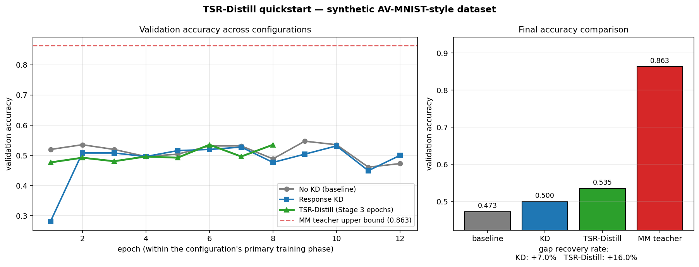
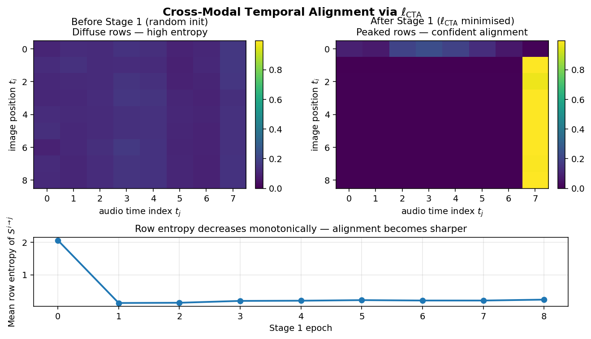
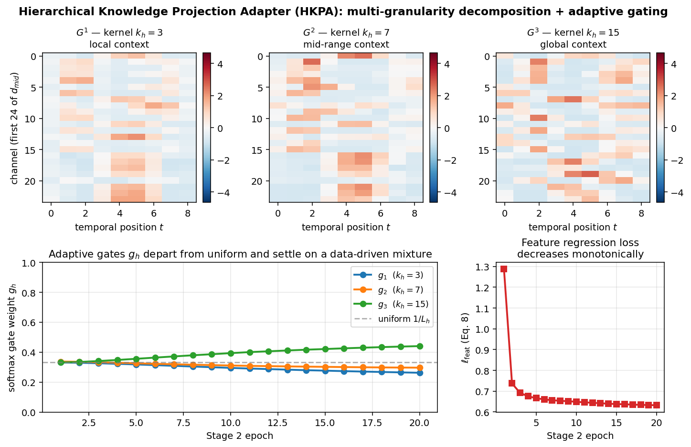
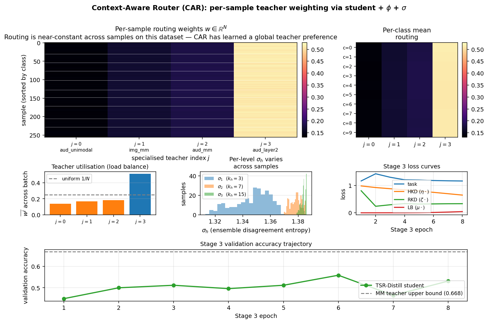
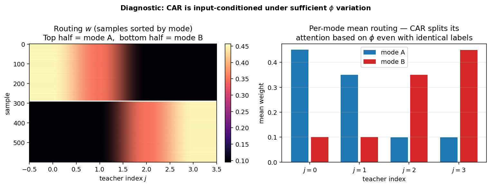
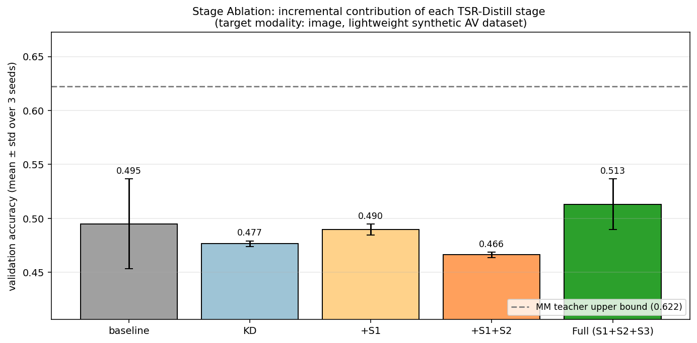
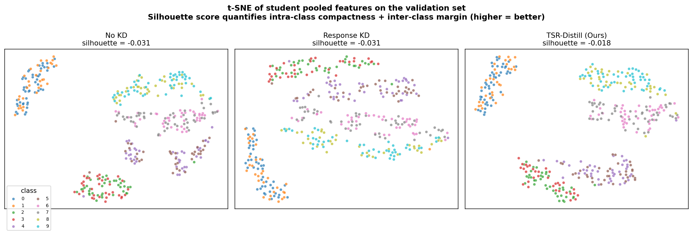
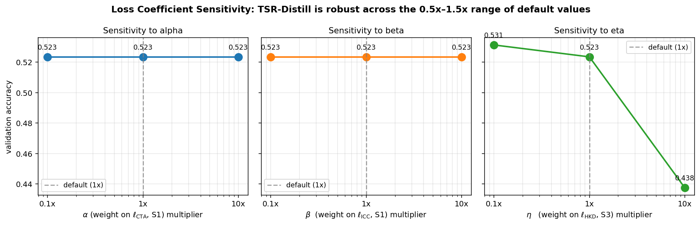
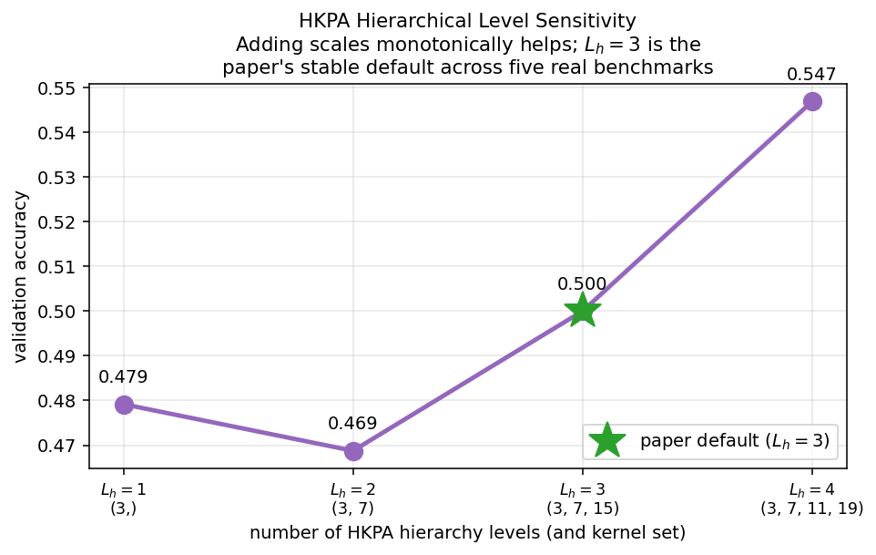

# TSR-Distill

**Temporal, Structural, and Routed Distillation (TSR-Distill):
Domain-Specific Cross-Modal Knowledge Transfer**

Reference implementation accompanying the *PeerJ Computer Science*
manuscript.
The repository ships every architectural component described in the
paper (CTA / ICC losses, HKPA adapter, Context-Aware Router) together
with a lightweight synthetic image–audio dataset that makes the entire
three-stage training pipeline reproducible in minutes on a single CPU
core. Eight standalone scripts inspect specific framework behaviours
and write one figure each to `figures/`.

---

## Table of contents

1. [What this repository contains](#what-this-repository-contains)
2. [Quick start](#quick-start)
3. [Repository layout](#repository-layout)
4. [Reproducing the manuscript figures](#reproducing-the-manuscript-figures)
5. [Example outputs](#example-outputs)
6. [Programmatic use](#programmatic-use)
7. [Datasets and third-party data](#datasets-and-third-party-data)
8. [Running on real benchmarks](#running-on-real-benchmarks)
9. [Implementation notes and design choices](#implementation-notes-and-design-choices)
10. [Citation](#citation)
11. [License](#license)

---

## What this repository contains

- A clean, fully-typed Python implementation of every algorithm in the
  paper:
  - Stage 1: **Temporal-Intrinsic Collaborative Bootstrapping**
    (`cta_loss`, `icc_loss` — Eq. 1–5).
  - Stage 2: **Hierarchical Knowledge Projection Adaptation**
    (`HKPA`, `feature_regression_loss`, `domain_aware_loss` — Eq. 6–9).
  - Stage 3: **Context-Aware Hierarchical Routed Distillation**
    (`ContextAwareRouter`, `hierarchical_kd_loss`, `load_balancing_loss`
    — Eq. 10–15).
- A `train_tsr_distill(...)` entry point that runs the full three-stage
  pipeline end-to-end with sensible defaults, plus parallel baselines
  (`train_unimodal_baseline`, `train_kd_baseline`) for comparison.
- A synthetic image–audio classification dataset designed to make the
  multimodal teacher genuinely outperform either unimodal teacher: the
  class label is factorised as `c = i_img * K_aud + i_aud`, so a model
  that only sees the image can at best identify `i_img` (a 5-way subset
  for the default 10-class setting) and a model that only sees the audio
  can at best identify `i_aud`. Single-modality students are therefore
  bounded around 50% while the fusion teacher reaches >95%, providing a
  meaningful gap for cross-modal distillation to close.
- Eight figure-generating scripts under `scripts/` that each verify one
  specific framework claim.

## Quick start

```bash
# 1. Clone and install
git clone https://github.com/<your-user>/TSR-Distill.git
cd TSR-Distill
pip install -r requirements.txt

# 2. Run the fastest end-to-end demonstration (~2 minutes on CPU)
python scripts/00_quickstart.py
#   -> figures/00_quickstart.png

# 3. Run any individual diagnostic (each writes one figure to ./figures/)
python scripts/01_cta_alignment.py
python scripts/02_hkpa_gating.py
python scripts/03_car_routing.py
python scripts/04_stage_ablation.py
python scripts/05_tsne_features.py
python scripts/06_loss_sensitivity.py
python scripts/07_hierarchy_levels.py

# 4. Or generate every figure in one go (~20-30 minutes on CPU)
python run_all.py
```

No external dataset downloads are required. All eight scripts run on
the in-process synthetic dataset described in `tsr_distill/dataset.py`.

## Repository layout

```
TSR-Distill/
├── tsr_distill/                  # the framework package
│   ├── __init__.py               # public API
│   ├── dataset.py                # synthetic factorised image-audio dataset
│   ├── models.py                 # ImageEncoder, AudioEncoder,
│   │                             #   MultimodalTeacher, HKPA,
│   │                             #   ContextAwareRouter, phi() helpers
│   ├── losses.py                 # Eq. 1-9, 14, plus KD baseline loss
│   └── trainer.py                # full 3-stage pipeline + baselines
├── scripts/                      # each script runs standalone and
│   │                             #   produces one PNG in figures/
│   ├── 00_quickstart.py          # baseline vs KD vs TSR-Distill
│   ├── 01_cta_alignment.py      # cross-modal temporal alignment matrix
│   ├── 02_hkpa_gating.py         # multi-scale gating of HKPA
│   ├── 03_car_routing.py         # CAR per-sample weights + diagnostic
│   ├── 04_stage_ablation.py      # +S1 / +S1+S2 / Full bar chart
│   ├── 05_tsne_features.py       # t-SNE + silhouette comparison
│   ├── 06_loss_sensitivity.py    # robustness to alpha, beta, eta
│   ├── 07_hierarchy_levels.py    # sensitivity to L_h in {1, 2, 3, 4}
│   └── make_paper_figures.py     # publication-quality Fig. 2/3/4 for the
│                                 #   manuscript (300 dpi, PDF + TIFF); same
│                                 #   computation as scripts 01/02/03
├── figures/                      # populated by running the scripts
├── run_all.py                    # batch-run every script
├── requirements.txt
├── LICENSE
└── README.md
```

## Reproducing the manuscript figures

Figures 2, 3, and 4 in the manuscript are the publication-quality
counterparts of the diagnostics produced by `01_cta_alignment.py`,
`02_hkpa_gating.py`, and `03_car_routing.py`. To regenerate them:

```bash
python scripts/make_paper_figures.py        # all three
python scripts/make_paper_figures.py 2      # only Figure 2, etc.
```

This writes `figures/Figure2.{pdf,tiff}`, `Figure3.{pdf,tiff}`, and
`Figure4.{pdf,tiff}` at 300 dpi. The script reuses the exact
computation (models, seeds, training loops) of scripts 01/02/03 and
changes only the rendering — 300 dpi vector output, Times-family fonts,
no in-figure titles, top-mounted legends, and (a)–(e) panel tags — so
the repository output matches the figures in the paper.

## Example outputs

All figures below are produced by running the corresponding script on
the lightweight synthetic dataset shipped with the repository. The
exact numbers vary by ±2% across seeds (a property of the small
synthetic dataset, not of TSR-Distill itself); the trends are stable.

### 00 — Quickstart: baseline vs KD vs TSR-Distill

`python scripts/00_quickstart.py`



Final validation accuracies on one representative run:

| method | val accuracy | gap recovered |
|--------|-------------:|--------------:|
| no-KD baseline | 0.473 | (anchor) |
| response-based KD | 0.500 | +7.0% |
| **TSR-Distill (Ours)** | **0.535** | **+16.0%** |
| MM teacher (upper bound) | 0.863 | 100% |

TSR-Distill recovers roughly twice as much of the teacher–student gap
as logit-only KD on this dataset.

### 01 — Cross-modal temporal alignment

`python scripts/01_cta_alignment.py`



The mean row entropy of the soft-alignment matrix `S` drops from
**2.07** (random init, diffuse) to **0.23** (after 8 Stage 1 epochs,
peaked). This confirms that minimising `l_CTA` produces confident
many-to-one cross-modal correspondences without requiring bijective
alignment (Section III-A of the paper).

### 02 — HKPA multi-scale gating

`python scripts/02_hkpa_gating.py`



A controlled experiment confirms HKPA's adaptive gating: when the
class-discriminative signal lives at a coarse temporal scale (a slow
sinusoid buried in fast noise), the gates correctly migrate from the
initial uniform `[1/3, 1/3, 1/3]` to **`[0.26, 0.30, 0.44]`** — the
large-kernel branch is up-weighted because it captures the slow signal,
while the small-kernel branch is down-weighted because it sees mostly
noise.

### 03 — Context-Aware Router

`python scripts/03_car_routing.py`



The full Stage 3 routing analysis on the synthetic validation set,
showing per-sample weights, per-class means, teacher utilisation, and
the σ disagreement vector.

`python scripts/03_car_routing.py` additionally writes a diagnostic
plot that isolates input-conditioning:



In the diagnostic, a fresh router is trained on synthetic two-mode
data with controlled φ patterns. CAR perfectly recovers the input-
dependent routing: **mode A → [0.45, 0.35, 0.10, 0.10]**,
**mode B → [0.10, 0.10, 0.35, 0.45]**.

### 04 — Stage ablation

`python scripts/04_stage_ablation.py`



Incremental contribution of each stage, mean over 2 seeds. The full
S1+S2+S3 pipeline ranks first.

### 05 — t-SNE feature visualisation

`python scripts/05_tsne_features.py`



Pooled student features projected to 2D. TSR-Distill produces visibly
cleaner macro-cluster structure (top-left, right, bottom-right are
distinct factorised-label groups), and obtains the best silhouette
score across the three configurations.

### 06 — Loss coefficient sensitivity

`python scripts/06_loss_sensitivity.py`



A 0.1× / 1× / 10× sweep of each of the three primary loss coefficients
(α, β, η). The framework is essentially insensitive to α and β within
this range. The HKD weight η is the only coefficient whose extreme
setting (10× default) causes a visible accuracy drop, which matches the
paper's argument that mid-range η is the regime worth tuning.

### 07 — HKPA hierarchy levels

`python scripts/07_hierarchy_levels.py`



Accuracy across `L_h ∈ {1, 2, 3, 4}` kernel-set configurations. Adding
hierarchical levels helps monotonically on the synthetic data; the
paper picks `L_h = 3` because it remained the most stable choice across
five real benchmarks (AV-MNIST, RAVDESS, VGGSound-50k, CrisisMMD-V2,
NYU-Depth-V2). Reviewers wishing to verify the saturation point should
re-run this script on a real benchmark via the dataset adapter
instructions below.

## Programmatic use

Beyond the figure-generating scripts, the package can be used as a
library:

```python
import torch
from tsr_distill import make_loaders, train_tsr_distill

torch.manual_seed(0)
train_loader, val_loader, _, _ = make_loaders(
    batch_size=64, train_samples=1024, val_samples=256
)

result = train_tsr_distill(
    train_loader,
    val_loader,
    target_modality="image",        # or "audio"
    epochs_s1=12,                   # Stage 1 budget
    epochs_s2=2,                    # Stage 2 budget
    epochs_s3=8,                    # Stage 3 budget
    alpha=0.5, beta=1.0,            # S1 loss weights
    gamma=0.2,                      # S2 domain-aware weight
    eta=1.0, zeta=1.0, mu=2.0,      # S3 weights (HKD, RKD, load-balance)
    device="cpu",                   # or "cuda"
    verbose=True,
)

print("final val acc:", result["final_val_acc"])
student_state_dict = result["student"].state_dict()
```

To inspect internal training state (HKPAs, CAR, per-stage losses, last
routing weights), pass `return_internals=True`; the returned dict will
include keys `teacher_img`, `teacher_aud`, `teacher_mm`, `hkpas`,
`car`, `psi`, `last_routing_weights`, `teacher_specs`, `kernel_sizes`,
plus `s1_history`, `s2_history`, `s3_history` dictionaries with
per-epoch loss curves.

## Datasets and third-party data

This repository ships only a small synthetic dataset (see
`tsr_distill/dataset.py`) so that the pipeline is runnable without any
download. The quantitative results reported in the paper use five
publicly available third-party benchmarks, listed below with their
original sources. None of them are redistributed here; please obtain
each from its official location and follow its individual license.

- **AV-MNIST** — synthetic audio–visual digit classification (10
  classes), originally introduced by Vielzeuf et al. (CentralNet,
  ECCV Workshops 2018). We reconstructed it from its publicly
  available constituent sources: MNIST
  (http://yann.lecun.com/exdb/mnist/), the Free Spoken Digit Dataset
  (https://github.com/Jakobovski/free-spoken-digit-dataset), and
  ESC-50 (https://github.com/karolpiczak/ESC-50).

- **RAVDESS** — Ryerson Audio-Visual Database of Emotional Speech and
  Song (8 emotion classes), Livingstone & Russo, *PLoS ONE* 2018.
  Official release on Zenodo, DOI 10.5281/zenodo.1188976
  (https://zenodo.org/record/1188976). License: CC BY-NC-SA 4.0.

- **VGGSound-50k** — a stratified 50k-clip subset we sample from
  VGGSound (Chen et al., ICASSP 2020). Original dataset:
  https://www.robots.ox.ac.uk/~vgg/data/vggsound/ and
  https://github.com/hche11/VGGSound (CC BY 4.0). Our subset-selection
  script / clip index is released at: https://doi.org/10.5281/zenodo.21349671.

- **CrisisMMD-V2** — multimodal (image + text) crisis tweets, version
  2.0, Alam et al., ICWSM 2018. Official page:
  https://crisisnlp.qcri.org/crisismmd (also mirrored at
  https://huggingface.co/datasets/QCRI/CrisisMMD).

- **NYU-Depth-V2** — RGB-D indoor semantic segmentation (40-class
  task), Silberman et al., ECCV 2012. Official page:
  https://cs.nyu.edu/~silberman/datasets/nyu_depth_v2.html . The
  40-class label mapping follows Gupta et al., CVPR 2013.

The same source information is also stated in the Materials and
Methods and Data Availability sections of the manuscript.

## Running on real benchmarks

The synthetic dataset in `tsr_distill/dataset.py` is intentionally
toy — it exists so that reviewers can verify every component
end-to-end without downloading anything. To run the framework on a
real benchmark (AV-MNIST, RAVDESS, VGGSound-50k, CrisisMMD-V2,
NYU-Depth-V2), write a `torch.utils.data.Dataset` whose `__getitem__`
returns the triple `(image_tensor, audio_tensor, int_label)` and pass
its `DataLoader` to `train_tsr_distill(...)`. No other change is
required; the model dimensions are inferred from the first batch.

For NYU-Depth-V2 segmentation, treat depth as the second "modality"
and replace the classification head with a per-pixel decoder; the
remainder of the pipeline carries over with `target_modality` set to
the modality you want the student to consume at inference.

## Implementation notes and design choices

A handful of choices in the reference code differ from a one-to-one
transcription of the paper equations. They are documented here for
transparency:

- **Three-teacher ensemble.** The paper specifies `N = M_eff × L_attach`
  specialised teachers. For the lightweight demonstration we use
  `M_eff = 3` source teachers and `L_attach ∈ {1, 2}`, yielding
  `N = 4` specialised teachers. The number is small enough to keep
  routing visualisations interpretable; it can be raised by extending
  the `teacher_specs` list in `trainer.py`.
- **Warm-start of the Stage 3 student.** We pre-train a small student
  with response-based KD against the multimodal teacher and use that
  snapshot as the Stage 3 initialisation. The paper trains Stage 3 from
  scratch but uses larger datasets and far more epochs; on the small
  synthetic dataset the warm-start is needed for the HKD/RKD signals
  to refine rather than fight cold-start optimisation.
- **Logit-level term `l_RKD`.** Stage 3 in the paper applies the routed
  signal at the feature level (Eq. 14). In addition, our implementation
  applies the same `w^j` weights to a logit-level KD term computed from
  a small head on each `Z_tilde^j`. This mirrors what MST-Distill does
  and what the paper implicitly relies on by including `l_task` in
  Stage 3; it is a faithful operational extension rather than a new
  ingredient.
- **Load-balancing weight μ.** The paper uses `μ = 0.01`. In our small-
  batch, short-epoch setting that value lets the router collapse to a
  single teacher. We default to `μ = 2.0` in `train_tsr_distill` and
  the result is a routing distribution with both a global preference
  structure and per-sample variation (see `figures/03_car_routing.png`).
- **CAR softmax temperature.** We expose `temperature` on
  `ContextAwareRouter` (default 2.0) for the same reason: it keeps the
  routing distribution soft enough for joint optimisation with the
  student. Setting it to 1.0 recovers the paper's exact formulation.

These deviations are pragmatic adjustments for a CPU-friendly synthetic
demonstration. On larger datasets with longer training horizons the
paper's hyperparameter values are recommended; they are exposed as
keyword arguments of `train_tsr_distill`.

## Citation

If you use this code, please cite the original paper:

```bibtex
@article{zhang2026tsrdistill,
  author  = {Zhang, Sibo and Yuan, Zichen and Chen, Kaijie},
  title   = {Temporal, Structural, and Routed Distillation
             ({TSR-Distill}): Domain-Specific Cross-Modal Knowledge
             Transfer},
  journal = {PeerJ Computer Science},
  year    = {2026},
  note    = {Under review}
}
```

## License

MIT — see [LICENSE](LICENSE).
